# OmniStream

High-performance C++17 telemetry agent for autonomous vehicle simulation. Generates synthetic sensor data at 60Hz with zero-copy memory management and real-time visualization.

## Architecture

```mermaid
flowchart LR
    subgraph agent["C++ Agent"]
        SG["SensorGenerator\n60Hz Loop"] --> Q["ThreadSafe\nQueue"]
        Q --> NC["NetworkClient\ngRPC Stream"]
    end
    
    subgraph dashboard["Dashboard Server"]
        PY["Python\nBridge"] --> WS["WebSocket\nBroadcast"]
        WS --> BR["Browser\nDashboard"]
    end
    
    NC -.-> PY
    
    style agent fill:#1a1a2e
    style dashboard fill:#16213e
```



## Prerequisites

### macOS

```bash
brew install cmake grpc protobuf
pip3 install websockets
```

### Ubuntu/Debian

```bash
sudo apt-get install -y cmake build-essential libgrpc++-dev protobuf-compiler-grpc
pip3 install websockets
```

## Quick Start

### Step 1: Build the C++ Agent

```bash
cd omni-stream
mkdir -p build && cd build
cmake ..
make -j$(nproc)
```

### Step 2: Start the C++ Agent

```bash
./build/omnistream
```

You should see:
```
========================================
  OmniStream Telemetry Agent v1.0
  60Hz | C++17 | gRPC
========================================
Vehicle: AV-001
Server:  localhost:50051
Mode:    SIMULATE

[Physics] Tick 60 | Queue: 0
[Network] Sent 60 | Queue: 0
```

### Step 3: Start the Dashboard Server

Open a new terminal:

```bash
cd omni-stream/dashboard
python3 telemetry_receiver.py
```

You should see:
```
==================================================
  OmniStream Dashboard Server
==================================================
  Mode:      SIMULATE
  Dashboard: http://localhost:8000
  WebSocket: ws://localhost:8765
==================================================
[Server] Tick 60 | Clients: 0
```

### Step 4: Open the Dashboard

Open your browser to: **http://localhost:8000**

## What You'll See in the Dashboard

The dashboard displays four real-time visualization panels:

| Panel | What It Shows |
|-------|---------------|
| **Lidar Scan** | Polar plot of 1024 distance readings, rotating as the vehicle "scans" its environment |
| **IMU Accelerometer** | Live graph of X (red), Y (cyan), Z (yellow) acceleration in m/s² |
| **Battery Status** | Current battery level with voltage, current draw, and estimated range |
| **Performance Metrics** | Tick rate (Hz), latency (ms), total packets received, uptime |

The header shows:
- **Connection status** (green = connected)
- **Vehicle ID** (e.g., AV-001)

All data updates at 60Hz from the C++ agent.

## CLI Options

### C++ Agent

```
./omnistream [options]
  --vehicle ID      Vehicle identifier (default: AV-001)
  --server ADDR     gRPC server address (default: localhost:50051)
  --real            Enable live gRPC mode
  --help            Show help
```

### Dashboard Server

```
python3 telemetry_receiver.py [options]
  --mode simulate   Synthetic data (default)
  --mode grpc       Connect to C++ agent
```

## Project Structure

```
omni-stream/
├── src/
│   ├── main.cpp              # Entry point
│   ├── sensor_generator.hpp  # 60Hz data generation
│   ├── thread_safe_queue.hpp # Concurrent queue
│   └── network_client.hpp    # gRPC client
├── dashboard/
│   ├── telemetry_receiver.py # WebSocket bridge
│   ├── index.html            # Dashboard UI
│   ├── styles.css            # Dark theme
│   └── app.js                # Visualizations
├── protos/
│   └── telemetry.proto       # Data schema
└── CMakeLists.txt
```

## Stopping the Application

1. Press `Ctrl+C` in the dashboard terminal
2. Press `Ctrl+C` in the C++ agent terminal

Both will shut down gracefully.

## License

MIT
