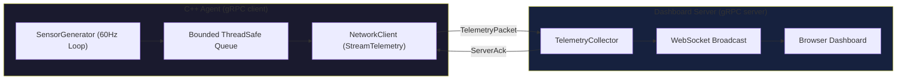

# OmniStream

C++17 telemetry agent for autonomous vehicle simulation. Generates synthetic sensor data on a 60Hz loop, streams it over gRPC to a Python collector, and visualizes it live in the browser.


## Architecture


```mermaid
flowchart LR
    subgraph agent["C++ Agent (gRPC client)"]
        SG["SensorGenerator (60Hz Loop)"] --> Q["Bounded ThreadSafe Queue"]
        Q --> NC["NetworkClient (StreamTelemetry)"]
    end
    
    subgraph dashboard["Dashboard Server (gRPC server)"]
        TC["TelemetryCollector"] --> WS["WebSocket Broadcast"]
        WS --> BR["Browser Dashboard"]
    end
    
    NC -- "TelemetryPacket" --> TC
    TC -- "ServerAck" --> NC
    
    style agent fill:#1a1a2e
    style dashboard fill:#16213e
```

### Which side is the gRPC server

The service in `protos/telemetry.proto` is `rpc StreamTelemetry(stream TelemetryPacket) returns (stream ServerAck)`. The request stream carries telemetry, and in gRPC the client owns the request stream, so the party producing telemetry has to be the client. That makes the **C++ agent the gRPC client** and the **Python dashboard the gRPC server**.

Beyond the proto contract, this is the direction that fits the problem:

- Fan-in matches the deployment. Vehicles are numerous and short lived, the collector is one long lived process at a known address. Agents dial out to it, the same way real fleet telemetry works.
- The browser attaches to the collector, so the collector has to be the stable, addressable end anyway.
- It keeps the agent's threading model intact. Backpressure flows the whole way back without any extra machinery.

### Backpressure

One chain, no queue growth anywhere:

1. The browser or the WebSocket relay stalls, so the collector stops reading its request stream.
2. The HTTP/2 flow control window closes, so the agent's `Write()` blocks.
3. The network thread stops popping, so the bounded queue (capacity 1000) fills.
4. `queue.push()` blocks the physics thread, which throttles generation at the source.

The agent also drains in-flight packets on shutdown rather than dropping them, so `Ctrl+C` flushes what was already generated.

## Prerequisites

### Ubuntu/Debian

```bash
sudo apt-get install -y build-essential cmake pkg-config \
    libgrpc++-dev libprotobuf-dev protobuf-compiler protobuf-compiler-grpc
pip3 install -r dashboard/requirements.txt
```

### macOS

```bash
brew install cmake grpc protobuf
pip3 install -r dashboard/requirements.txt
```

The build accepts either the distro packages above (found through pkg-config) or a source install of gRPC and Protobuf (found through their CMake config packages).

## Quick Start

### Step 1: Build the C++ Agent

```bash
cd omni-stream
mkdir -p build && cd build
cmake ..
make -j$(nproc)
```

### Step 2: Generate the Python gRPC Stubs

```bash
cd dashboard
python3 gen_protos.py
```

### Step 3: Start the Dashboard Server

The dashboard listens, so it goes first.

```bash
python3 telemetry_receiver.py
```

You should see:
```
==================================================
  OmniStream Dashboard Server
==================================================
  Source:    C++ AGENT over gRPC
  gRPC in:   0.0.0.0:50051
  Dashboard: http://localhost:8000
  WebSocket: ws://localhost:8765
==================================================
[Server] WebSocket on ws://0.0.0.0:8765
[gRPC] TelemetryStream listening on 0.0.0.0:50051
[Server] Waiting for agents. Start one with: omnistream --server localhost:50051
```

### Step 4: Start the C++ Agent

Open a new terminal:

```bash
./build/omnistream
```

You should see:
```
========================================
  OmniStream Telemetry Agent v1.0
  60Hz | C++17 | gRPC
========================================
Vehicle: AV-001
Server:  localhost:50051
Mode:    LIVE

[Network] Connected to localhost:50051
[Physics] Tick 60 | Queue: 1
[Network] Sent 60 | Acked 59 | Queue: 0
```

`Acked` counts `ServerAck` messages coming back from the collector, so a rising `Acked` means the round trip is live. The collector logs the other half:

```
[gRPC] Agent stream opened from ipv6:%5B::1%5D:35044
[Server] Relayed 58 packets from cpp-agent | Clients: 1
```

If nothing is listening, the agent says so instead of pretending to send:

```
[Network] No collector at localhost:50051 after 5s
[Network] OFFLINE, discarding packets without sending
```

### Step 5: Open the Dashboard

Open your browser to: **http://localhost:8000**

## Docker

```bash
docker network create omni-net

docker build -t omnistream-dashboard -f Dockerfile.dashboard .
docker run -d --name dashboard --network omni-net \
    -p 8000:8000 -p 8765:8765 omnistream-dashboard

docker build -t omnistream-agent -f Dockerfile .
docker run --rm --network omni-net omnistream-agent \
    --vehicle AV-001 --server dashboard:50051
```

The agent image builds against Ubuntu's packaged gRPC and Protobuf, so it compiles in under a minute instead of building gRPC from source.

## Fallback Simulator

`--mode simulate` replaces the agent with synthetic data generated inside the Python process. It exists so the UI can be demoed without a compiled binary. **No gRPC is involved and no C++ code runs in this mode.** It is labelled everywhere it appears: the startup banner, the per second log line, the `source` and `simulated` fields on every WebSocket payload, and an amber `SIMULATED` badge in the dashboard header. The vehicle ID is `SIM-001` rather than `AV-001`.

```bash
python3 telemetry_receiver.py --mode simulate
```

## CLI Options

### C++ Agent

```
./omnistream [options]
  --vehicle ID      Vehicle identifier (default: AV-001)
  --server ADDR     Collector address (default: localhost:50051)
  --offline         Generate without streaming anywhere
  --help            Show help
```

Live gRPC is the default. `--offline` runs the generator and discards packets after the queue, which is useful for measuring the generator alone.

### Dashboard Server

```
python3 telemetry_receiver.py [options]
  --mode grpc       Receive from C++ agents (default)
  --mode simulate   Synthetic fallback, no agent, no gRPC
  --grpc-port PORT  Port to accept agents on (default: 50051)
```

## What You'll See in the Dashboard

| Panel | What It Shows |
|-------|---------------|
| **Lidar Scan** | Polar plot of 1024 distance readings, rotating as the vehicle "scans" its environment |
| **IMU Accelerometer** | Live graph of X (red), Y (cyan), Z (yellow) acceleration in m/s² |
| **Battery Status** | Current battery level, with voltage, current draw and range derived from it for display |
| **Performance Metrics** | Tick rate (Hz), latency (ms), total packets received, uptime |

The header shows connection status, the telemetry source (`C++ AGENT` or an amber `SIMULATED`), and the vehicle ID.

The agent paces generation at 60Hz off `steady_clock` (about 56Hz in practice, see Performance Notes), and the collector relays every packet it receives, so the browser receives and counts the full stream. Chart redraws are throttled to roughly 15 FPS (`VISUAL_UPDATE_MS` in `app.js`) so rendering does not become the bottleneck. The latency figure compares the agent's `system_clock` timestamp against the browser's clock, so it only means something when both run on the same machine.

## Performance Notes

- **Packets are not copied between threads.** The generator allocates each `TelemetryPacket` once and moves ownership across the queue as a `std::unique_ptr`, so the roughly 4 KB payload (1024 packed floats plus IMU and battery fields) changes hands by pointer. It is not zero-copy end to end: gRPC serializes the message onto the wire, and the collector converts it to JSON for the browser.
- **The lidar array is `[packed=true]`**, so 1024 floats cost about 4 KB on the wire instead of a tag per element.
- **The queue is bounded and blocking**, which is a deliberate choice over an unbounded queue. A slow consumer throttles the producer instead of growing memory without limit.
- Measured with both sides in containers: two agents streamed 1016 and 1018 packets into a single collector over 18 seconds, every packet acked, with each agent's queue sitting at 0 to 1 entries because the collector kept up. That is about 56Hz per agent rather than a clean 60, since each frame pays for generation and `sleep_for` granularity inside the 16.667ms budget.

## Project Structure

```
omni-stream/
├── src/
│   ├── main.cpp              # Entry point, thread setup
│   ├── sensor_generator.hpp  # 60Hz data generation
│   ├── thread_safe_queue.hpp # Bounded blocking queue
│   └── network_client.hpp    # gRPC client, StreamTelemetry
├── dashboard/
│   ├── telemetry_receiver.py # WebSocket bridge and fallback simulator
│   ├── telemetry_service.py  # gRPC server, TelemetryStream service
│   ├── gen_protos.py         # Generates the Python stubs
│   ├── requirements.txt      # Python dependencies
│   ├── index.html            # Dashboard UI
│   ├── styles.css            # Dark theme
│   └── app.js                # Visualizations
├── protos/
│   └── telemetry.proto       # Data schema and service contract
├── Dockerfile                # Agent image
├── Dockerfile.dashboard      # Dashboard image
└── CMakeLists.txt
```

## Stopping the Application

1. Press `Ctrl+C` in the C++ agent terminal. It drains the queue, closes the stream and reports totals.
2. Press `Ctrl+C` in the dashboard terminal.

Both shut down gracefully. The agent also exits on its own if the collector disappears, rather than filling the queue behind a dead stream.
